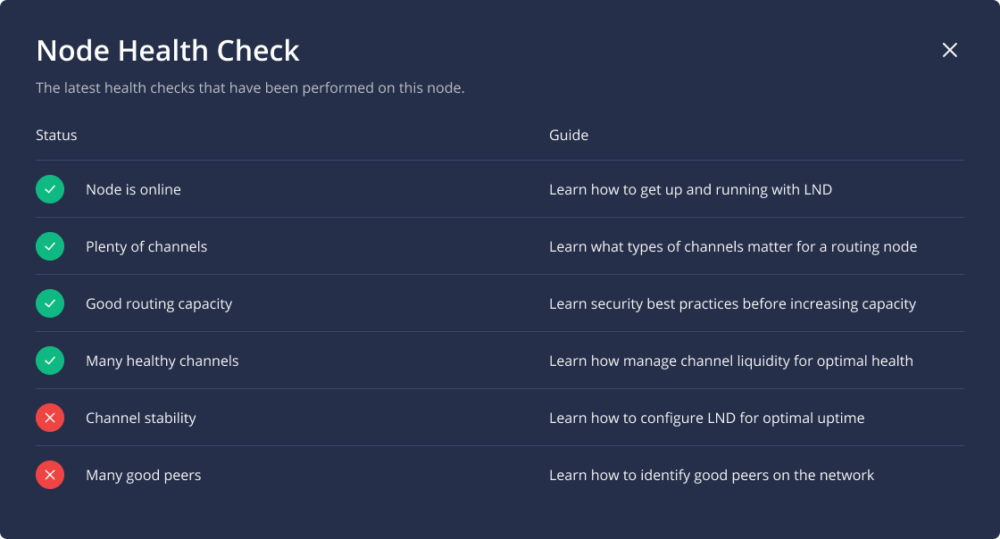

# Health Checks

Lightning Terminal uses various health checks to assess a node’s ability to route payments through the Lightning Network. Health checks are far from perfect. They are not overly specific as they are a general measure for routing nodes, not a concrete target meant to gamify the process.

A node configured mainly for receiving or sending payments, such as the node of a merchant, might not pass the formal health checks, and a high performing routing node serving the edges of the network might earn more routing fees than one ranked higher. Health checks are just a general measure for routing nodes.

Passing your health checks and ranking high in Terminal is a measure of your ability to receive, make, and route payments in the general Lightning Network. Identifying these nodes helps entrants determine how they can most easily get connected to the wider network themselves, either through outbound or inbound liquidity.

When starting up your node, Terminal will suggest nodes you can establish channels to. These nodes are chosen from nodes that pass five of the health checks, but are in need of more good peers. By connecting to these nodes you can help your own node as well as your peer get closer to the goal of passing all health checks, while also decentralizing the network as a whole. As you adapt your personal Lightning Node to your personal needs, ideally, you will rely less and less on these recommendations and the scores of others. This transition is due to the fact that while onboarding into the Lightning Network can be prescriptive, further advancing as a routing node is more competitive and less supervised.

### Node is online 

Your node has to be online. Many high performing routing nodes are able to be reachable via Tor.

[Read more about how to set up your Lightning Node.](../lnd/run-lnd.md)

### Plenty of channels 

Your node needs to have plenty of channels to be considered a good routing node.

[Learn how to identity peers to open channels to.](../../the-lightning-network/the-gossip-network/identify-good-peers.md)

### Good routing capacity 

Each channel should have enough capacity to be able to route a reasonably sized Lightning payment in either direction. That does not mean the channel needs to be perfectly balanced, but rather that there is enough capacity available in either direction to pass on a payment.

### Many healthy channels

Set a reasonably large minimum channel size for incoming connections, and close unused or inactive channels. Opening channels to merchants that are only periodically online, or allowing others with mobile clients to open channels to you can be a good source of income, but such channels should be set to private.

### Channel stability

Not only should your own node be online as much as possible, your channels should be too. Make sure your channels are active, and monitor them regularly.

### Many good peers

Your channels should be public and reach out to other good routing nodes. It can also be of advantage to reach out and connect to other pending nodes, as this elevates two nodes at once and improves network connectivity overall.

## Further considerations 

Health checks are vague not only because defining or measuring a good routing node exactly is difficult, but also because the Lightning Network derives its strengths from its dishomogeneity. If a strict and clear ranking mechanism existed, our nodes would become more and more homogenous and the network weaker.

Instead, it’s important for route operators to educate themselves about what it means to provision liquidity in the Lightning Network, learn where capital is allocated best and dare to take novel and unique paths to connect participants from all around the graph.

[Learn about the concept of liquidity in the Lightning Network.](../../the-lightning-network/liquidity/understanding-liquidity.md)
